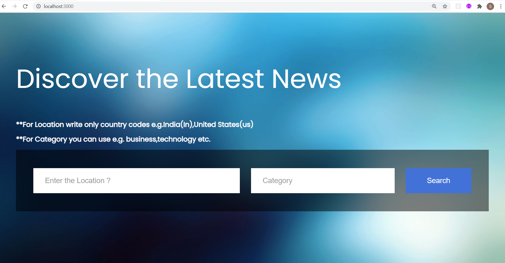
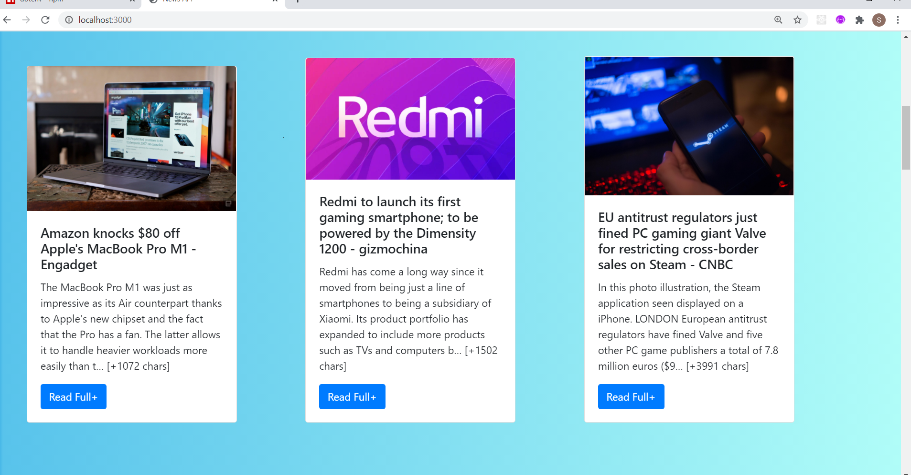
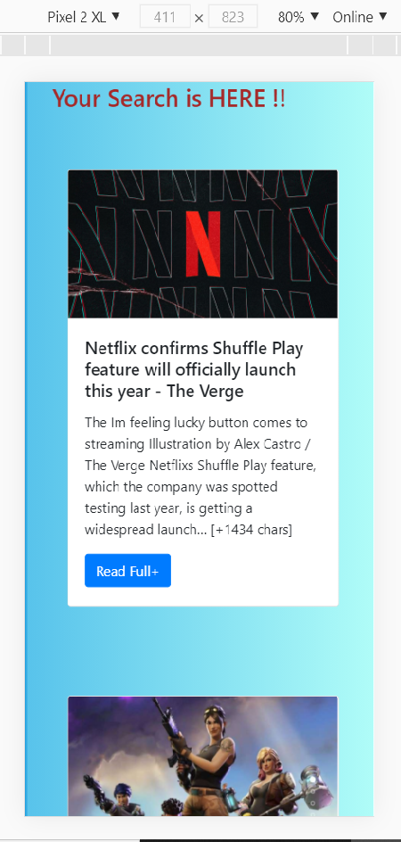

# News-API
News API is a simple HTTP REST API for searching and retrieving live articles from all over the web.
Search worldwide news with code
Get breaking news headlines, and search for articles from news sources and blogs all over the web with our news API

# Working
1.Its very simple first you have to Enter country and your interest
2. then you can view your news

# To open to your local system 
Install node_modules using express and run localhost:3000/

# Added Some Screenshots of the project

# After the search

# Responsiveness of web app

